# Министерство образования
Учреждение образования
«Белорусский государственный университет информатики и
радиоэлектроники»

Специальность «Программная инженерия»
Кафедра программного обеспечения информационных технологий
Учебная дисциплина «Компьютерные системы и сети»

## ОТЧЁТ
по лабораторной работе №5
«Удалённое файловое хранилище (REST API по HTTP)»

**Выполнил:** Волков А. С.

**Проверила:** Болтак С. В.

Минск 2026

---

## Цель работы

Реализовать удалённое файловое хранилище, предоставляющее REST API по протоколу HTTP. URL запроса задаёт логическое расположение файла/каталога в хранилище. Реализовать операции загрузки, получения, просмотра каталога, получения метаданных и удаления. Дополнительно реализовать копирование файла в новое расположение.

---

## Реализация

Сервер реализован на стандартной библиотеке Python (`http.server`, `ThreadingHTTPServer`) и обрабатывает запросы в классе `StorageHandler` (файл `storage_server.py`).

### Защита от выхода за пределы хранилища

Преобразование URL‑пути в путь на файловой системе выполняется функцией `safe_join(root, url_path)`:

- декодирование URL (`%xx`);
- нормализация POSIX‑пути (`posixpath.normpath`);
- запрет `..` и проверка, что итоговый путь остаётся внутри `root`.

### Форматы ответов

- Для **файлов** в `GET` используется потоковая выдача (без чтения целиком в память).
- Для **каталогов** в `GET` возвращается JSON со списком `items` (name/type/size/mtime).
- `HEAD` возвращает только заголовки `Content-Length` и `Last-Modified`.

### Копирование файла (дополнительное задание)

Копирование реализовано через `PUT` на целевой путь с заголовком `X-Copy-From`, который содержит исходный путь в хранилище, например:

`X-Copy-From: /docs/hello.txt`

Копирование выполняется через временный файл в целевом каталоге и атомарную замену (`replace`), чтобы избежать частично записанных файлов.

---

## Поддерживаемые методы (REST API)

- **PUT** `/path/to/file` — загрузка/перезапись файла
  - `201 Created` — создан новый файл
  - `200 OK` — файл перезаписан
- **PUT** `/path/to/new_file` + `X-Copy-From: /path/to/src_file` — копирование файла
  - `201 Created` — создан новый файл по целевому пути
  - `200 OK` — целевой файл перезаписан (или копирование в самого себя — no-op)
  - `404 Not Found` — исходный файл не найден
- **GET** `/path/to/file` — получить файл
- **GET** `/path/to/dir/` — получить список каталога (JSON)
- **HEAD** `/path/to/file` — метаданные файла (только заголовки)
- **DELETE** `/path/to/file_or_dir` — удалить файл/каталог
  - `204 No Content` — удалено
  - `404 Not Found` — не найдено

---

## Тестирование (Postman)

Сервер запускался командой:

    python3 storage_server.py --host 0.0.0.0 --port 8000 --root storage_data

### Проверка доступности сервера

**Рисунок 1 – GET корня (проверка, что сервер жив)**

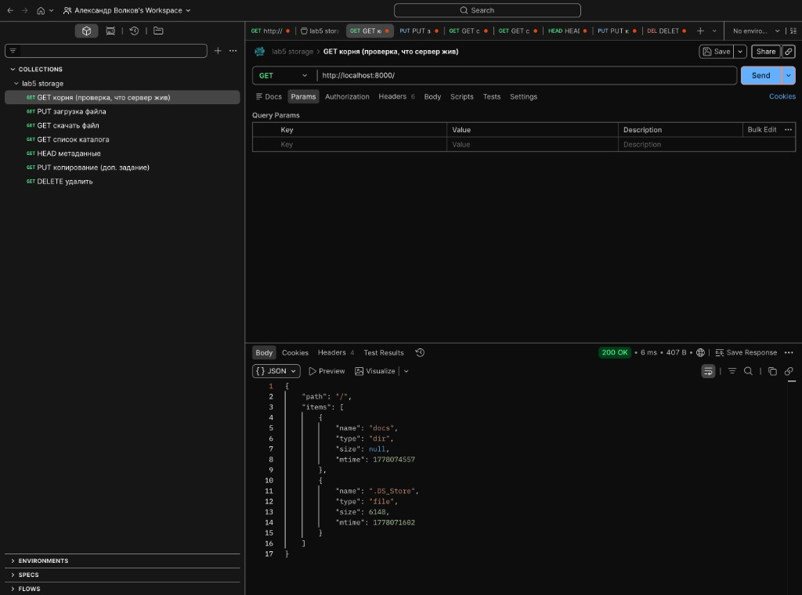

### Загрузка файла (PUT)

**Рисунок 2 – PUT загрузка файла**

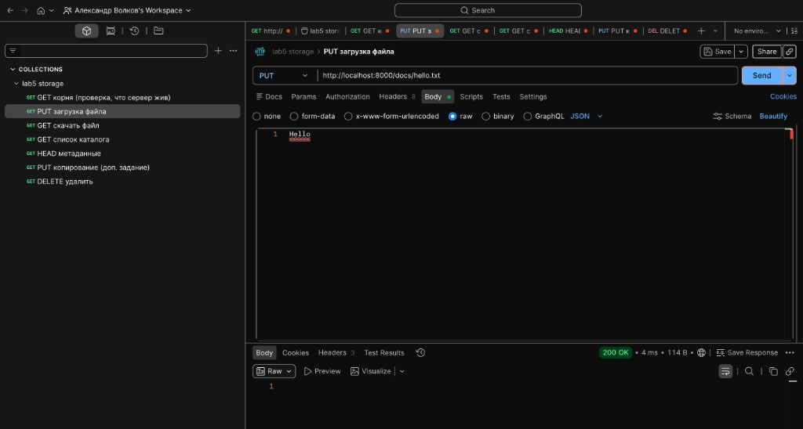

### Получение файла (GET)

**Рисунок 3 – GET скачать файл**

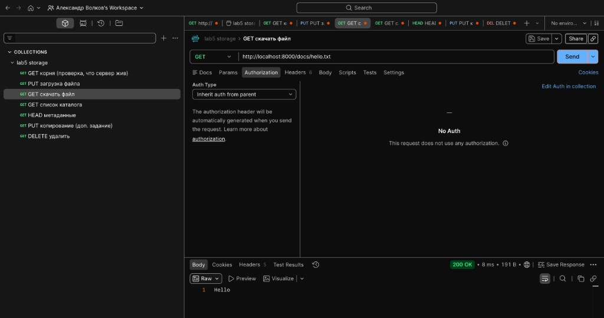

### Получение списка каталога (GET dir → JSON)

**Рисунок 4 – GET список каталога**

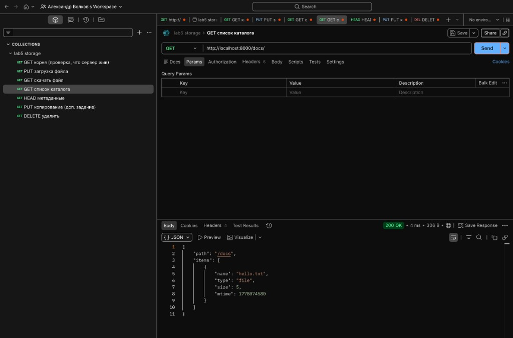

### Метаданные файла (HEAD)

**Рисунок 5 – HEAD метаданные**

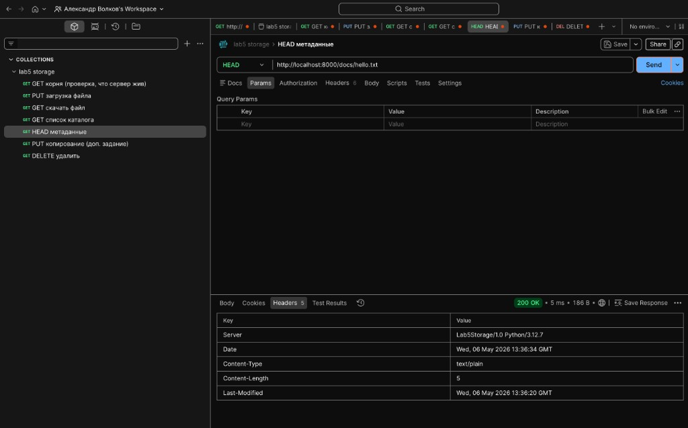

### Копирование файла (дополнительное задание)

**Рисунок 6 – PUT копирование (X-Copy-From)**

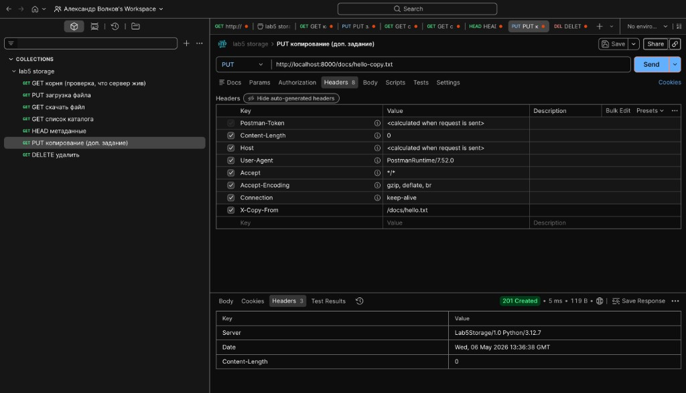

### Проверка копии (GET)

**Рисунок 7 – GET скачивание копии**

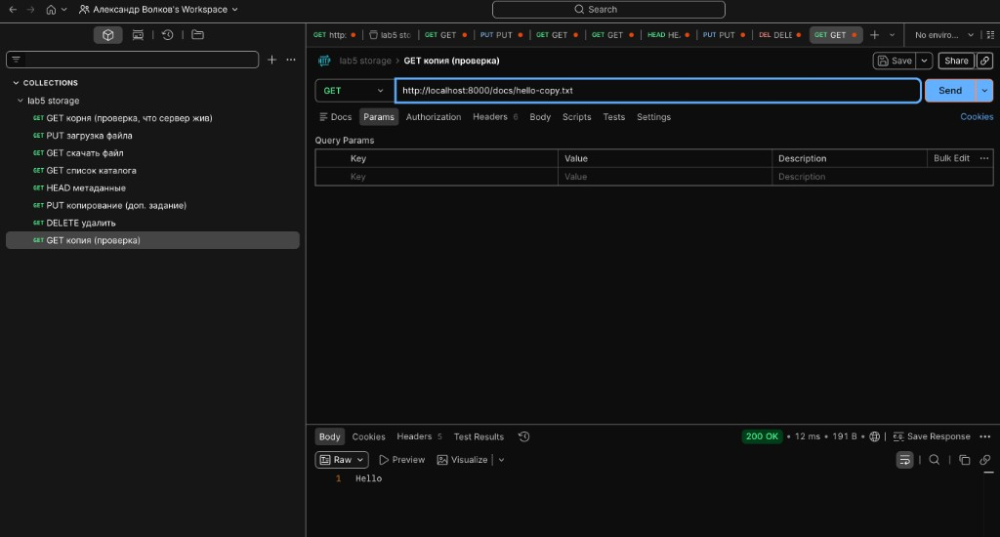

### Негативная проверка копирования (источник не найден)

**Рисунок 8 – PUT копирование: источник не найден (404)**

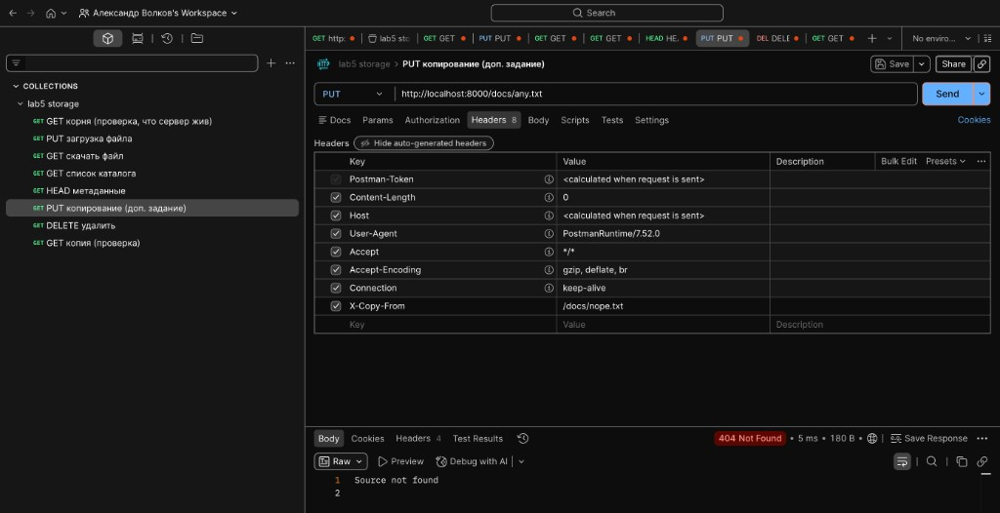

### Удаление (DELETE)

**Рисунок 9 – DELETE удалить файл**

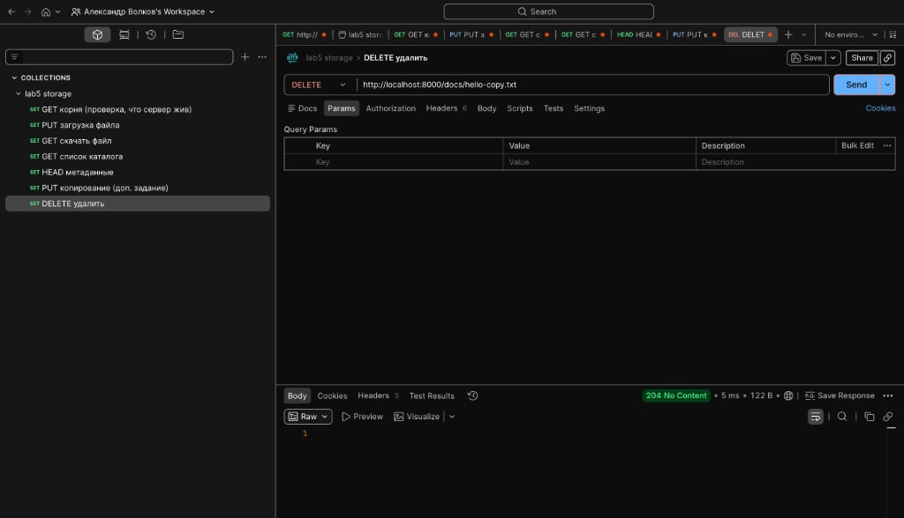

### Логи сервера (коды + расшифровка)

**Рисунок 10 – журнал запросов в терминале**

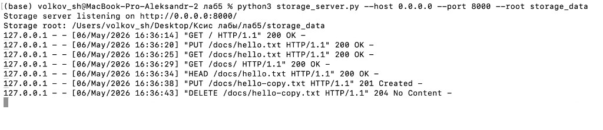

**Рисунок 11 – журнал запросов (после доп. тестов)**

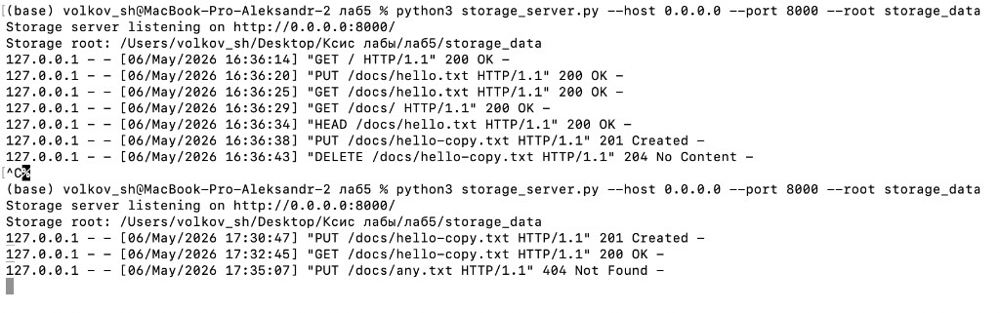

---

## Вывод

Реализовано удалённое файловое хранилище с REST API по HTTP: загрузка и перезапись файлов через `PUT`, получение файлов через `GET`, вывод списка каталогов в формате JSON через `GET` для директорий, получение метаданных через `HEAD` и удаление файлов/каталогов через `DELETE`. Дополнительно реализовано копирование файлов в новое расположение через `PUT` с заголовком `X-Copy-From`. Результаты тестирования подтверждают корректную работу всех функций.

